# TC3005B.501

Web portal for companies to have a flow of travel applications by employees
who require some sort of support from the company. Be it a reimbursement,
advancement, hotel and/or flight reservations.

## Process State Diagram

The process of processing a travel request application is represented by the
following state diagram from start to finish:

```mermaid
stateDiagram
  direction LR
  [*] --> Trip_Quote: N1 creates application
  [*] --> Second_Revision: N2 creates application

  state applicant_creates_application <<choice>>
  [*] --> applicant_creates_application: Applicant creates application
  applicant_creates_application --> First_Revision: Finished
  applicant_creates_application --> Draft: Unfinished
  Draft --> First_Revision: Applicant finishes application

  state n2_reviews_application <<choice>>
  First_Revision --> n2_reviews_application: N2 reviews application
  n2_reviews_application --> Second_Revision: Approves
  n2_reviews_application --> Rejected: Rejects

  state n1_reviews_application <<choice>>
  Second_Revision --> n1_reviews_application: N1 reviews application
  n1_reviews_application --> Trip_Quote: Approves
  n1_reviews_application --> Rejected: Rejects

  state trip_quoted <<choice>>
  Trip_Quote --> trip_quoted: Trip Quoted
  trip_quoted --> Trip_Expenses_Verification: No hotel or flight needed
  trip_quoted --> Travel_Agency_Attention: Hotel or flight needed

  Travel_Agency_Attention --> Trip_Expenses_Verification
  Trip_Expenses_Verification --> Voucher_Verification

  state applicant_cancels_application <<join>>
  Draft --> applicant_cancels_application
  First_Revision --> applicant_cancels_application
  Second_Revision --> applicant_cancels_application
  Travel_Agency_Attention --> applicant_cancels_application
  Trip_Quote --> applicant_cancels_application
  applicant_cancels_application --> Canceled: Applicant cancels application

  state accounts_payable_reviews <<choice>>
  Voucher_Verification --> accounts_payable_reviews: Accounts Payable Reviews
  accounts_payable_reviews --> Finalized: Approved
  accounts_payable_reviews --> Trip_Expenses_Verification: Rejected

  Finalized --> [*]
  Rejected --> [*]
  Canceled --> [*]
```

